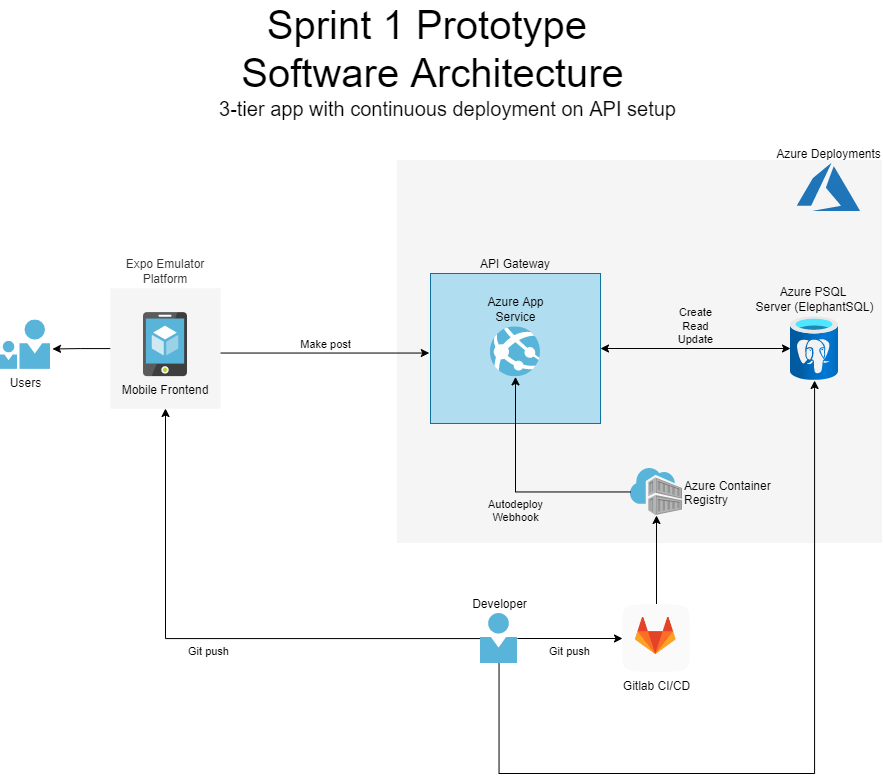

# Architecture

We have decided that a microservices architecture is the best software architecture for our app, as our app consisted of many loosely coupeled services such as posts/comments, post search, user management, and messaging. In addition, the high agility of this architecture supports our Agile team structure, and allows us to divide up small teams to focus on different services without stepping on each others toes. We also may plan out additional features, which are fairly trivial to add as a new microservice. Finally, it allows for ease of scalability, as in the future when we gain more users, we need to scale up to be able to support the increased load, and microservices architecture helps support this.

## Sprint 1 Architectural Choices

Despite our plan to use a microservices architecture, we decided that for our first sprint, we would use an N-tier architecture. Because the microservices architecture has high complexity and almost requires CI/CD to be successful, we would not have enough time in a shortened sprint to implement a functional microservices architecture. An N-tier architecture was deemed suitable for this initial sprint, where much of development would be basic setup of environments, codebases, and DevOps tools and practices, in additional to onboarding new members. This allowed us to quickly deploy a functional prototype, while still being able to easily adapt the architecture to a microservices architecture due to several common elements, such as the mobile frontend and API gateway.

### Architecture Deep Dive

-   Frontend: React Native based mobile app (Android + iOS) running only locally for now, as mobile deployment requires multiple steps that we did not have time to setup. Makes basic PUT requests to the API to create posts.
-   API Gateway: Flask API deployed as container image to Azure App Service, with full CI/CD pipeline that deploys the API as a container to Azure Container Registry, then autodeploys to Azure App Service with a web hook. Exposes two endpoints: /posts/ and /posts/<post_id>, the former of which reads a list of posts from the database, and the latter of which allows for creates/updates to posts and reads to a post's content.
-   Database: PostgreSQL Server hosted with ElephantSQL (which uses Azure Database for PostgreSQL). Stores a simple database with just a single table of posts.

## Links and References

-   Microservices architecture: https://docs.microsoft.com/en-us/azure/architecture/guide/architecture-styles/microservices
-   N-tier architecture: https://docs.microsoft.com/en-us/azure/architecture/guide/architecture-styles/n-tier
-   Architecture for startups: https://docs.microsoft.com/en-us/azure/architecture/example-scenario/startups/core-startup-stack
