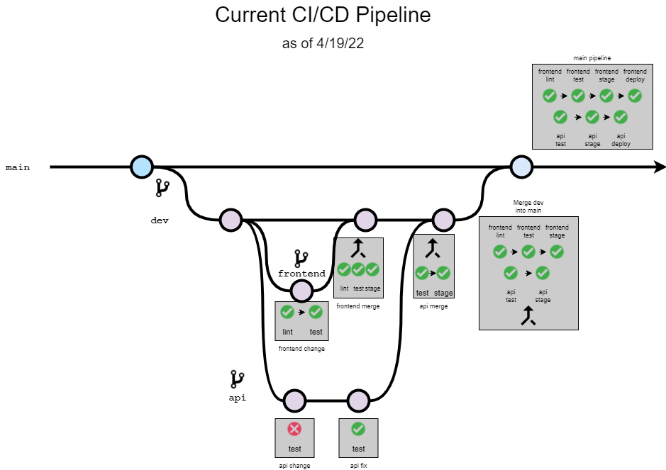

# CI/CD

On Gitlab, the `.gitlab-ci.yml` in the root of the project allows for creation of a CI/CD pipeline for automatic building, testing, and deploying when making commits and merges. A good guide of CI/CD concepts for Gitlab can be found here: https://docs.gitlab.com/ee/ci/introduction/

## General notes

-   The pipeline can be specified to run only on commits to certain branches or changes to certain directories or files so that different stages can be run on different directories.
-   Defining `image` in the pipeline file will allow a Docker image to be pulled to run the job in. This can be useful for having environments with pre-installed apps and packages.

## Current CI/CD Pipeline

Due to the project being a monorepo, we decided to utilize a parent-child pipeline with two children pipelines that run on changes in `Code/frontend` and `Code/api`. Each child pipeline acts as a Directed Acyclic Graph, so that each successive job is dependent on the completion of the previous job. 

