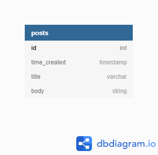

# Databases

Using the microservices architecture, we will be using one database per service. For early prototypes, we will use a single database, but migrating to separate databases when work on the services begin.

## Posts database

### Sprint 1

The first iteration of the shared database for posts will follow the following schema:

